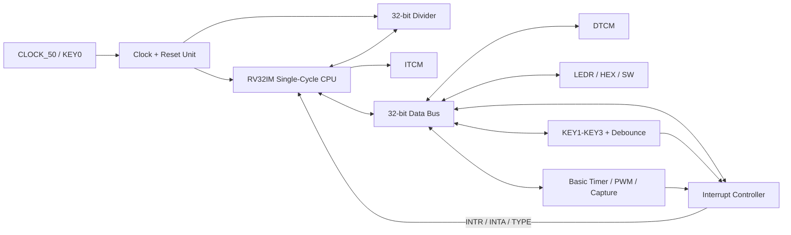

# RV32IMscMCU - Architecture Specification

Status: Phase 1 baseline architecture, 12.08.2026

Target: Terasic DE10-Standard, Cyclone V SX SoC `5CSXFC6D6F31C6N`.

## Scope

The mandatory design is a structural single-cycle RV32IM MCU.  Pipeline and
UART remain outside the active scope.  The original lab and instructor folders
are immutable references; implementation work is contained in `DUT`, `TB`,
`SIM`, `DOC`, and `Quartus`.

## Top-level architecture

The final MCU entity is `RV32IMscMCU`, and both it and the CPU core remain
structural.  Phase 1 instantiates the unchanged CPU datapath behind this stable
top-level name.  Phase 2 will move the DTCM connection to the MCU data-bus
interconnect so that reads can be returned from either DTCM or MMIO.

## Data-bus contract

The CPU is the only bus master.

| Signal | Width | Direction from CPU | Meaning |
|---|---:|---|---|
| `dbus_addr` | 32 | output | Full byte address; low bits must never be discarded before MMIO decode |
| `dbus_wdata` | 32 | output | Store data; byte peripherals consume bits 7:0 |
| `dbus_rdata` | 32 | input | Selected DTCM/MMIO/interrupt return data |
| `dbus_read` | 1 | output | Valid load transaction |
| `dbus_write` | 1 | output | Valid store transaction |

Rules:

1. DTCM is selected for byte addresses `0x00000000-0x00001FFF`.
2. MMIO is selected for byte addresses `0x00002000-0x00003FFF`.
3. DTCM receives word index `dbus_addr(12 downto 2)` only after selection.
4. MMIO decode uses the complete address, including bits 1:0.  This is required
   for `HEX0/HEX1`, `HEX2/HEX3`, `HEX4/HEX5`, and `IE/IFG/TYPE`.
5. Provided applications use `lw/sw` even for byte-resolution registers.  MMIO
   writes consume the low byte and reads return zero-extended values.
6. Exactly one read source may drive `dbus_rdata`; unmapped reads return zero.
7. A write may target either DTCM or one peripheral, never both.

## Address map

The canonical VHDL constants are in `mcu_memory_map_pkg.vhd`.

| Region/register | Address | Access |
|---|---:|---|
| DTCM word bases | `0x0000-0x1FFC` | R/W word |
| MMIO region | `0x2000-0x3FFF` | decoded |
| `PORT_LEDR` | `0x2000` | low byte R/W |
| `PORT_HEX0` | `0x2004` | low byte R/W |
| `PORT_HEX1` | `0x2005` | low byte R/W |
| `PORT_HEX2` | `0x2008` | low byte R/W |
| `PORT_HEX3` | `0x2009` | low byte R/W |
| `PORT_HEX4` | `0x200C` | low byte R/W |
| `PORT_HEX5` | `0x200D` | low byte R/W |
| `PORT_SW` | `0x2010` | low byte R |
| `PORT_PB` | `0x2014` | low byte R |
| UART reserved | `0x2018-0x201A` | bonus, inactive |
| `BTCTL1` | `0x201C` | low byte R/W |
| `BTCTL2` | `0x201D` | low byte R/W |
| `BTCMPR0` | `0x2020` | word R/W |
| `BTCMPR1` | `0x2024` | word R/W |
| `BTCAPR` | `0x2028` | word R |
| `IE` | `0x202C` | low byte R/W |
| `IFG` | `0x202D` | low byte R/W1C/software clear as defined per source |
| `TYPE` | `0x202E` | low byte R |

## Clock plan

| Domain | Planned source | Purpose |
|---|---|---|
| `CLOCK_50` | DE10-Standard 50 MHz oscillator | Board reference clock |
| `sysclk` | Cyclone V PLL output, initially 25 MHz | CPU, DTCM, GPIO, timer and interrupt controller |
| `DIVCLK` | 50 MHz clock derived/qualified by the clock unit | Divider's 32-cycle iterative datapath |

The legacy `PLL.vhd` targets Cyclone II and is not used.  During the phase-1
Quartus scaffold, the CPU is clocked directly by `CLOCK_50`; this only verifies
analysis and synthesis.  Before divider integration, a Cyclone V clock/reset
unit will provide the final domains and PLL-lock handling.

No fabric-generated clock may be used as a clock input.  Clock selection in the
timer will use clock-enable pulses inside the `sysclk` domain.

## Reset plan

- `KEY0` is the external active-low system reset.
- Internal reset is active-high.
- Assertion may be asynchronous; deassertion must be synchronized separately
  into `sysclk` and `DIVCLK` using two flip-flops.
- The final reset remains asserted until the Cyclone V PLL reports lock.
- KEY1-KEY3 are data/interrupt inputs and never participate in system reset.
- The phase-1 wrapper performs only `not KEY(0)` because the final clock/reset
  unit is deliberately scheduled before multi-clock logic is introduced.

## Divider handshake and CDC

The CPU launches one request with stable operands and operation metadata.  The
request is converted to a toggle or otherwise lossless handshake in `DIVCLK`.
The divider captures operands once, asserts busy for 32 iterations, registers
quotient/remainder, and returns a synchronized completion event.  The CPU holds
architectural state while busy and performs exactly one write-back after done.
Every multi-bit transfer is held stable for the duration of its handshake; only
single-bit control events pass through two-flop synchronizers.

## Interrupt interface

| Signal | Producer | Consumer | Meaning |
|---|---|---|---|
| `INTR` | interrupt controller | CPU | At least one enabled pending source exists while GIE is set |
| `INTA` | CPU | interrupt controller | CPU is accepting the selected source |
| `TYPE[7:0]` | interrupt controller | CPU data bus | Vector-table byte offset for the highest-priority source |

Priority without UART is RESET, Basic Timer, KEY1, KEY2, KEY3.  UART vector
positions remain reserved.  CPU entry is a two-cycle FSM: capture TYPE and clear
GIE in cycle 1, then store `PC+4` in `tp` and jump through the vector table in
cycle 2.  `jalr zero, 0(tp)` acts as `reti` and restores GIE.

## Planned source boundaries

| Unit | Responsibility |
|---|---|
| `RV32IMscMCU.vhd` | Structural board/MCU top-level only |
| `RV32I_CORE.vhd` | CPU structure and later interrupt/divider stall integration |
| `mcu_memory_map_pkg.vhd` | Canonical addresses and interrupt TYPE values |
| `mcu_interconnect.vhd` | DTCM/MMIO select and read mux, phase 2 |
| `gpio_peripheral.vhd` | LED/HEX/SW registers and seven-segment encoding, phase 2 |
| `divider.vhd` | Iterative unsigned core, phase 3 |
| `clock_reset_unit.vhd` | Cyclone V clocks, synchronized resets and CDC support |
| `basic_timer.vhd` | Timer, compare, PWM and capture, phase 4 |
| `pushbutton_unit.vhd` | Synchronization, debounce and event detection, phase 5 |
| `interrupt_controller.vhd` | IE, IFG, TYPE and priority, phase 6 |

## Phase-1 decisions

1. Existing reference folders are read-only.
2. `RV32IMscMCU` is the stable final top-level entity name.
3. The 32-bit address is byte-based throughout the interconnect.
4. DTCM word addressing occurs only at the RAM boundary.
5. UART addresses and vector slots are reserved but inactive.
6. The pipeline implementation is not compiled into the mandatory design.
7. ModelSim execution and baseline memory comparison are explicitly deferred;
   their checklist entries remain open in `PROJECT_PLAN.md`.
