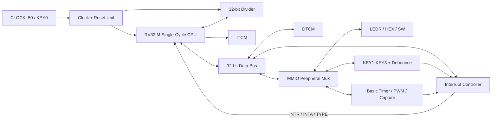

# RV32IMscMCU - Architecture Specification

Status: Stages 4–5 integrated and automatically verified, 17.08.2026 22:09 IDT

Target: Terasic DE10-Standard, Cyclone V SX SoC `5CSXFC6D6F31C6N`.

## Scope

The mandatory design is a structural single-cycle RV32IM MCU.  Pipeline and
UART remain outside the active scope.  The original lab and instructor folders
are immutable references; implementation work is contained in `DUT`, `TB`,
`SIM`, `DOC`, and `Quartus`.

## Top-level architecture

The final MCU entity is `RV32IMscMCU`, and both it and the CPU core remain
structural. The CPU exposes one data bus to `mcu_interconnect`; the interconnect
routes DTCM accesses locally and forwards MMIO accesses to `mcu_peripherals`.

## Data-bus contract

The CPU is the only bus master.

| Signal | Width | Direction from CPU | Meaning |
|---|---:|---|---|
| `dbus_addr` | 32 | output | Full byte address; low bits must never be discarded before MMIO decode |
| `dbus_wdata` | 32 | output | Store data; byte peripherals consume bits 7:0 |
| `dbus_rdata` | 32 | input | Selected DTCM/MMIO/interrupt return data |
| `dbus_read` | 1 | output | Valid load transaction |
| `dbus_write` | 1 | output | Valid store transaction |

Rules:

1. DTCM is selected for byte addresses `0x00000000-0x00001FFF`.
2. MMIO is selected for byte addresses `0x00002000-0x00003FFF`.
3. DTCM receives word index `dbus_addr(12 downto 2)` only after selection.
4. MMIO decode uses the complete address, including bits 1:0.  This is required
   for `HEX0/HEX1`, `HEX2/HEX3`, `HEX4/HEX5`, and `IE/IFG/TYPE`.
5. Provided applications use `lw/sw` even for byte-resolution registers.  MMIO
   writes consume the low byte and reads return zero-extended values.
6. Exactly one read source may drive `dbus_rdata`; unmapped reads return zero.
7. A write may target either DTCM or one peripheral, never both.

## Address map

The canonical VHDL constants are in `mcu_memory_map_pkg.vhd`.

| Region/register | Address | Access |
|---|---:|---|
| DTCM word bases | `0x0000-0x1FFC` | R/W word |
| MMIO region | `0x2000-0x3FFF` | decoded |
| `PORT_LEDR` | `0x2000` | low byte R/W |
| `PORT_HEX0` | `0x2004` | low byte R/W |
| `PORT_HEX1` | `0x2005` | low byte R/W |
| `PORT_HEX2` | `0x2008` | low byte R/W |
| `PORT_HEX3` | `0x2009` | low byte R/W |
| `PORT_HEX4` | `0x200C` | low byte R/W |
| `PORT_HEX5` | `0x200D` | low byte R/W |
| `PORT_SW` | `0x2010` | low byte R |
| `PORT_PB` | `0x2014` | low byte R |
| UART reserved | `0x2018-0x201A` | bonus, inactive |
| `BTCTL1` | `0x201C` | low byte R/W |
| `BTCTL2` | `0x201D` | low byte R/W |
| `BTCMPR0` | `0x2020` | word R/W |
| `BTCMPR1` | `0x2024` | word R/W |
| `BTCAPR` | `0x2028` | word R |
| `IE` | `0x202C` | low byte R/W |
| `IFG` | `0x202D` | low byte R/W1C/software clear as defined per source |
| `TYPE` | `0x202E` | low byte R |

## Clock plan

| Domain | Source | Purpose |
|---|---|---|
| `CLOCK_50` | DE10-Standard 50 MHz oscillator | Board reference clock |
| `sysclk` | Cyclone V PLL output, initially 25 MHz | CPU, DTCM, GPIO, timer and interrupt controller |
| `DIVCLK` | 50 MHz clock derived/qualified by the clock unit | Divider's 32-cycle iterative datapath |

The generated `PLL.vhd` targets Cyclone V and currently divides `CLOCK_50` by
two for the 25 MHz `sysclk`. The divider accelerator retains the 50 MHz board
clock and crosses to/from `sysclk` with its request/completion handshake.

No fabric-generated clock may be used as a clock input.  Clock selection in the
timer will use clock-enable pulses inside the `sysclk` domain.

## Reset plan

- `KEY0` is the external active-low system reset.
- Internal reset is active-high.
- Assertion may be asynchronous; deassertion must be synchronized separately
  into `sysclk` and `DIVCLK` using two flip-flops.
- The final reset remains asserted until the Cyclone V PLL reports lock.
- KEY1-KEY3 are data/interrupt inputs and never participate in system reset.
- The current wrapper asserts reset while KEY0 is pressed or the PLL is not
  locked. Synchronized reset deassertion will be reviewed before stage-5.5
  physical programming.

## Divider handshake and CDC

The CPU launches one request with stable operands and operation metadata.  The
request is converted to a toggle or otherwise lossless handshake in `DIVCLK`.
The divider captures operands once, asserts busy for 32 iterations, registers
quotient/remainder, and returns a synchronized completion event.  The CPU holds
architectural state while busy and performs exactly one write-back after done.
Every multi-bit transfer is held stable for the duration of its handshake; only
single-bit control events pass through two-flop synchronizers.

## Interrupt interface

| Signal | Producer | Consumer | Meaning |
|---|---|---|---|
| `INTR` | interrupt controller | CPU | At least one enabled pending source exists while GIE is set |
| `INTA` | CPU | interrupt controller | CPU is accepting the selected source |
| `TYPE[7:0]` | interrupt controller | CPU data bus | Vector-table byte offset for the highest-priority source |

Priority without UART is RESET, Basic Timer, KEY1, KEY2, KEY3.  UART vector
positions remain reserved.  CPU entry is a two-cycle FSM: capture TYPE and clear
GIE in cycle 1, then store `PC+4` in `tp` and jump through the vector table in
cycle 2.  `jalr zero, 0(tp)` acts as `reti` and restores GIE.

## Planned source boundaries

| Unit | Responsibility |
|---|---|
| `RV32IMscMCU.vhd` | Structural board/MCU top-level only |
| `RV32I_CORE.vhd` | CPU structure and later interrupt/divider stall integration |
| `mcu_memory_map_pkg.vhd` | Canonical addresses and interrupt TYPE values |
| `mcu_interconnect.vhd` | DTCM/MMIO select and read mux, phase 2 |
| `gpio_peripheral.vhd` | LED/HEX/SW registers and seven-segment encoding, phase 2 |
| `divider.vhd` | Iterative unsigned core, phase 3 |
| `PLL.vhd` | Cyclone V 50-to-25 MHz PLL and lock indication |
| `basic_timer.vhd` | Timer, compare, PWM and capture, phase 4 |
| `pushbutton_unit.vhd` | Synchronization, debounce and event detection, phase 5 |
| `interrupt_controller.vhd` | IE, IFG, TYPE and priority, phase 6 |

## Stage 4–5 implementation

`mcu_peripherals.vhd` is the single MMIO responder connected to the existing
interconnect. It instantiates GPIO, Basic Timer and pushbuttons, then selects one
read value and one `hit` response. This preserves the original CPU bus and the
stage-0–3 simulation harness interface.

The Basic Timer implements `BTCTL1`, `BTCTL2`, `BTCMPR0`, `BTCMPR1` and
read-only `BTCAPR`. `BTCNT` is internal and is exposed only as a debug signal.
Clock selections `/1`, `/2`, `/4` and `/8` are clock-enable pulses in the
`sysclk` domain. Compare 0 resets the up-counter, compare 1 changes PWM duty,
and synchronized capture inputs can latch rising or falling edges. Timer and
button events are one-`sysclk` pulses prepared for the stage-6 controller.

The pushbutton unit treats the board keys as active-low, synchronizes each input
with two flip-flops, debounces it for 250,000 `sysclk` cycles (10 ms at 25 MHz),
and emits one press event per stable press. `PORT_PB[2:0]` returns active-high
pressed states for KEY1, KEY2 and KEY3 respectively.

### Board-observation mapping prepared for stage 5.5

| Board signal | Current function |
|---|---|
| `KEY0` | active-low system reset |
| `KEY1`, `KEY2`, `KEY3` | debounced pushbuttons / future interrupt sources |
| `SW[7:0]` | GPIO switch port |
| `SW8` | timer `CAPIN1` |
| `SW9` | timer `CAPIN2` |
| `LEDR[7:0]` | GPIO LED register |
| `LEDR8` | direct PWM observation |
| `LEDR9` | high while any debounced key is pressed |

Physical pin assignments and the dedicated smoke-test firmware remain gated on
the user's ModelSim GUI evidence and belong to stage 5.5.

## Foundation decisions

1. Existing reference folders are read-only.
2. `RV32IMscMCU` is the stable final top-level entity name.
3. The 32-bit address is byte-based throughout the interconnect.
4. DTCM word addressing occurs only at the RAM boundary.
5. UART addresses and vector slots are reserved but inactive.
6. The pipeline implementation is not compiled into the mandatory design.
7. ModelSim and Quartus gates are tracked with timestamped evidence in
   `PROJECT_PLAN.md`.
